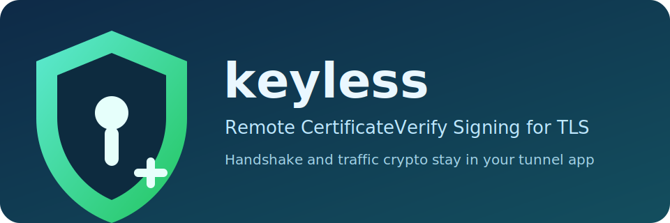

# keyless_tls



`keyless_tls` is designed so that the tunnel application handles the TLS handshake and traffic encryption/decryption, while only the `CertificateVerify` signature is delegated to a remote signer.

- TLS engine, session keys, traffic crypto: `tunneling app`
- TLS signing (`CertificateVerify`): remote `relay signer`
- Signer transport: `gRPC over TLS` by default, optional `mTLS`

This repository supports two usage modes:

1. Use as an SDK library (`keyless` package)
2. Run the provided binaries under `cmd/*`

## Choose your integration path first

- **I want to attach directly to my app (`http.Server`)**: SDK mode
- **I want to run it immediately and validate behavior**: Binary mode

---

## 1) Using the SDK library

### Core concept

The tunnel app keeps only the public certificate chain (`cert PEM`) and does **not** hold the private key.
The `keyless` SDK attaches a remote signer as if it were a `crypto.Signer`, so handshake signing is performed remotely.

### Public APIs

- `keyless.AttachToHTTPServer`: simplest entry point (attach directly to `http.Server`)
- `keyless.NewRemoteSigner`: create a remote signer client explicitly
- `keyless.NewServerTLSConfig`: build `tls.Config` manually

### Easiest setup (`AttachToHTTPServer`)

```go
package main

import (
    "log"
    "net/http"
    "os"

    "keyless_tls/keyless"
)

func main() {
    certPEM := mustRead("certs/public-chain.crt")

    mux := http.NewServeMux()
    mux.HandleFunc("/", func(w http.ResponseWriter, r *http.Request) {
        _, _ = w.Write([]byte("ok\n"))
    })

    srv := &http.Server{
        Addr:    ":8443",
        Handler: mux,
    }

    remoteSigner, err := keyless.AttachToHTTPServer(srv, keyless.HTTPServerAttachConfig{
        CertPEM: certPEM,
        RemoteSigner: keyless.RemoteSignerConfig{
            Endpoint:   "127.0.0.1:9443",
            ServerName: "relay.internal",
            KeyID:      "relay-cert",
            RootCAPEM:  mustRead("certs/relay-ca.crt"),
            // EnableMTLS: true,
            // ClientCertPEM: mustRead("certs/tunnel-client.crt"),
            // ClientKeyPEM:  mustRead("certs/tunnel-client.key"),
        },
    })
    if err != nil {
        log.Fatal(err)
    }
    defer remoteSigner.Close()

    log.Fatal(srv.ListenAndServeTLS("", ""))
}

func mustRead(path string) []byte {
    b, err := os.ReadFile(path)
    if err != nil {
        panic(err)
    }
    return b
}
```

### Advanced setup (`NewRemoteSigner` + `NewServerTLSConfig`)

Use this when you already have your own `tls.Config` construction flow, or when integrating with components other than `http.Server`.

```go
rSigner, err := keyless.NewRemoteSigner(remoteSignerCfg, certPEM)
if err != nil {
    // handle error
}
defer rSigner.Close()

tlsConf, err := keyless.NewServerTLSConfig(keyless.ServerTLSConfig{
    CertPEM:    certPEM,
    Signer:     rSigner,
    NextProtos: []string{"h2", "http/1.1"},
    // MinVersion: tls.VersionTLS13,
})
if err != nil {
    // handle error
}
```

### SDK integration checklist

- Deploy only the public certificate chain (`cert PEM`) in the tunnel app
- Configure signer endpoint/server name/`KeyID`/root CA
- Enable mTLS if needed (`EnableMTLS`, client cert/key)
- Call `remoteSigner.Close()` on shutdown

---

## 2) Using binaries

`cmd/` contains production-oriented `main` packages (runnable binaries).
Example applications are separated under `examples/`.

### Command layout

- `cmd/relay-signer`: remote signer gRPC server
- `cmd/relay-l4`: L4 TCP relay forwarding external port to the internal tunnel app
- `examples/tunnel-http`: example tunnel HTTP server integrated with the SDK

### Quick start with three processes

1) Run signer server

```bash
go run ./cmd/relay-signer \
  -listen :9443 \
  -key-id relay-cert \
  -tls-cert certs/relay-server.crt \
  -tls-key certs/relay-server.key \
  -sign-key certs/relay-signing.key
```

2) Run tunnel app

```bash
go run ./examples/tunnel-http \
  -listen :8443 \
  -cert certs/public-chain.crt \
  -signer-addr 127.0.0.1:9443 \
  -signer-name relay.internal \
  -key-id relay-cert \
  -root-ca certs/relay-ca.crt
```

3) Run L4 relay

```bash
go run ./cmd/relay-l4 \
  -listen :443 \
  -upstream 127.0.0.1:8443
```

### Protect signer with mTLS

Default mode is server-authenticated TLS.
To require client authentication as well, enable and align mTLS options on both signer and tunnel app.

```bash
go run ./cmd/relay-signer \
  -listen :9443 \
  -key-id relay-cert \
  -tls-cert certs/relay-server.crt \
  -tls-key certs/relay-server.key \
  -enable-mtls \
  -client-ca certs/client-ca.crt \
  -sign-key certs/relay-signing.key

go run ./examples/tunnel-http \
  -listen :8443 \
  -cert certs/public-chain.crt \
  -signer-addr 127.0.0.1:9443 \
  -signer-name relay.internal \
  -key-id relay-cert \
  -enable-mtls \
  -client-cert certs/tunnel-client.crt \
  -client-key certs/tunnel-client.key \
  -root-ca certs/relay-ca.crt
```

---

## Security and operations notes

- Store private keys only in `relay-signer`; never distribute them to tunnel apps
- Keep only the public certificate chain in tunnel apps
- Protect signer with at least TLS server auth; prefer mTLS + `KeyID`-scoped ACLs where possible

## Package structure

- `keyless`: SDK for application developers (tunnel app integration point)
- `keyless/signerclient`: remote signer client implementation
- `relay/signrpc`: signer RPC types/services
- `relay/signer`: signing service/key store
- `relay/server`: signer gRPC (TLS/mTLS) server launcher
- `relay/l4`: TCP passthrough relay

## Current status

This implementation is at an early stage. Before production use, consider adding:

- replay cache
- rate limiting
- key rotation policy
- observability (OTel/metrics/log correlation)
