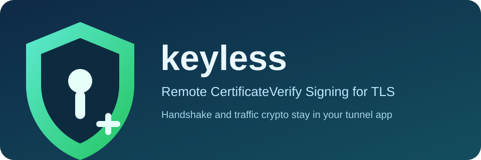

# keyless_tls



`keyless_tls` is designed so that the tunnel application handles the TLS handshake and traffic encryption/decryption, while only the `CertificateVerify` signature is delegated to a remote signer.

- TLS engine, session keys, traffic crypto: `tunneling app`
- TLS signing (`CertificateVerify`): remote `relay signer`
- Signer transport: `HTTPS + JSON` with mandatory `mTLS`

This repository supports two usage modes:

1. Use as an SDK library (`keyless` package)
2. Run the provided binaries under `cmd/*`

## Choose your integration path first

- **I want keyless remote signing for my TLS app**: transcript-bound keyless mode (`keyless` + `keyless/t13server`)
- **I want to run it immediately and validate behavior**: Binary mode

---

## 1) Using the SDK library

### Core concept

The tunnel app keeps only the public certificate chain (`cert PEM`) and does **not** hold the private key.
The `keyless` SDK provides a remote transcript signer: the TLS 1.3 handshake is performed by the tunnel
app (via `keyless/t13server`), and only the `CertificateVerify` transcript signature is delegated to the
remote signer over `/v1/sign`.

### Public APIs

- `keyless.NewRemoteSigner`: create a remote transcript signer client
- `keyless/t13server`: TLS 1.3 server engine that signs its handshake through a `TranscriptSigner`
  (it implements `net.Conn` and integrates with `http.Server`)
- `keyless.NewServerTLSConfig`: build a `tls.Config` for deployments that hold a **local** private key

### Easiest setup (`NewRemoteSigner` + `t13server`)

```go
package main

import (
    "log"
    "net"
    "net/http"
    "os"

    "github.com/gosuda/keyless_tls/keyless"
    "github.com/gosuda/keyless_tls/keyless/t13server"
)

// keylessListener upgrades raw TCP connections into transcript-bound keyless TLS connections.
type keylessListener struct {
    net.Listener
    tlsSrv *t13server.Server
}

func (l *keylessListener) Accept() (net.Conn, error) {
    raw, err := l.Listener.Accept()
    if err != nil {
        return nil, err
    }
    return l.tlsSrv.NewConn(raw, nil), nil
}

func main() {
    certPEM := mustRead("certs/public-chain.crt")

    rSigner, err := keyless.NewRemoteSigner(keyless.RemoteSignerConfig{
        Endpoint:      "127.0.0.1:9443",
        ServerName:    "relay.internal",
        KeyID:         "relay-cert",
        RootCAPEM:     mustRead("certs/relay-ca.crt"),
        ClientCertPEM: mustRead("certs/tunnel-client.crt"),
        ClientKeyPEM:  mustRead("certs/tunnel-client.key"),
    }, certPEM)
    if err != nil {
        log.Fatal(err)
    }
    defer rSigner.Close()

    tlsSrv, err := t13server.NewServer(t13server.Config{
        CertPEM:          certPEM,
        KeyID:            "relay-cert",
        TranscriptSigner: rSigner,
    })
    if err != nil {
        log.Fatal(err)
    }

    lis, err := net.Listen("tcp", ":8443")
    if err != nil {
        log.Fatal(err)
    }

    mux := http.NewServeMux()
    mux.HandleFunc("/", func(w http.ResponseWriter, r *http.Request) {
        _, _ = w.Write([]byte("ok\n"))
    })

    srv := &http.Server{Handler: mux}
    log.Fatal(srv.Serve(&keylessListener{Listener: lis, tlsSrv: tlsSrv}))
}

func mustRead(path string) []byte {
    b, err := os.ReadFile(path)
    if err != nil {
        panic(err)
    }
    return b
}
```

A runnable version lives in `examples/tunnel-http`.

If the signer endpoint is protected by a rotating access token, attach it with
`RemoteSignerConfig.Headers`. The callback runs for every `/v1/sign` request and
must be safe for concurrent use:

```go
remoteSignerCfg.Headers = func() http.Header {
    h := make(http.Header)
    h.Set("X-Portal-Access-Token", currentAccessToken())
    return h
}
```

### Local-key deployments (`NewServerTLSConfig`)

If a deployment holds its private key locally, `keyless.NewServerTLSConfig` builds a standard
`tls.Config` for Go's TLS stack. This path does not involve the remote signer.

### Encrypted ClientHello (ECH)

`keyless.NewServerTLSConfig` can pass ECH keys through to Go's TLS stack for
local-key deployments:

```go
tlsConf, err := keyless.NewServerTLSConfig(keyless.ServerTLSConfig{
    CertPEM: certPEM,
    Signer:  localSigner,
    EncryptedClientHelloKeys: []tls.EncryptedClientHelloKey{
        {
            Config:      echConfig,
            PrivateKey:  echPrivateKey,
            SendAsRetry: true,
        },
    },
})
```

The tunnel app must have the ECH private key because it owns the TLS handshake
and decrypts ClientHello. The remote signer still only signs
`CertificateVerify`; it does not receive ECH secrets or traffic keys.

ECH config generation and publication are intentionally external to this SDK.
Distribute the matching ECHConfigList to clients through your chosen control
plane, typically DNS HTTPS/SVCB records.

Client-side ECH fallback is intentionally opt-in because it trades SNI privacy
for availability. Use `DialClientTLS` with `AllowECHFallback` to retry once
without ECH only when Go reports `tls.ECHRejectionError`:

```go
tlsConf, err := keyless.NewClientTLSConfigWithOptions(keyless.ClientTLSConfigOptions{
    ServerName:                     "app.example.com",
    RootCAPEM:                      rootCAPEM,
    EncryptedClientHelloConfigList: echConfigList,
})
if err != nil {
    // handle error
}

conn, err := keyless.DialClientTLS(ctx, "tcp", "app.example.com:443", keyless.ClientDialConfig{
    TLSConfig:        tlsConf,
    AllowECHFallback: true,
})
```

### SDK: SNI metadata for relay routing (caller-controlled)

If you are implementing your own relay/proxy with this library, use the `relay/l4`
APIs to inspect ClientHello and route by SNI/ALPN while keeping all policy in caller code.

- `l4.InspectClientHello(conn, timeout)`: parse `ServerName`/`ALPNProtocols`/`ECHOffered` and return a wrapped `net.Conn`
- `l4.Proxy.DialByClientHello(ctx, info, parseErr)`: caller decides route/fallback/reject policy

How this works in practice:

1) incoming TCP connection arrives
2) library reads only visible ClientHello metadata (no TLS termination)
3) your callback receives `info.ServerName`, `info.ALPNProtocols`, `info.ECHOffered`, and `parseErr`
4) your code selects upstream target (or rejects)
5) relay continues raw TCP forwarding; TLS payload stays opaque to the relay

Typical SDK routing policies:

- Multi-tenant host routing: `app1.example.com -> tenant A`, `app2.example.com -> tenant B`
- Protocol-aware routing: `h2` preferred upstream vs `http/1.1` upstream
- Default fallback for unmatched visible SNI, including ECH outer SNI misses
- Strict security mode: reject when ClientHello parse fails
- Compatibility mode: fallback to default upstream when parse fails

Relay ECH policy is intentionally simple: the relay sees only the visible outer
SNI and whether ECH was offered. It does not see the encrypted inner SNI or TLS
payload. When `info.ECHOffered` is true, `info.ServerName` is the outer public
name. Route by that outer name, use the default upstream for unmatched outer SNI
when configured, or reject.

Concrete policy example (easy to adapt):

```go
routes := map[string]string{
    "app1.demo.local": "127.0.0.1:9001",
    "app2.demo.local": "127.0.0.1:9002",
}

proxy := &l4.Proxy{
    ListenAddr:         ":443",
    ClientHelloTimeout: 2 * time.Second,
    DialByClientHello: func(ctx context.Context, info l4.ClientHelloInfo, parseErr error) (net.Conn, error) {
        d := net.Dialer{Timeout: 3 * time.Second}

        // 1) Decide what to do with non-TLS / invalid ClientHello
        if parseErr != nil {
            // strict mode: return nil, parseErr
            // compatibility mode: send to default route
            return d.DialContext(ctx, "tcp", "127.0.0.1:9011")
        }

        // 2) SNI host-based route
        if target, ok := routes[strings.ToLower(strings.TrimSuffix(info.ServerName, "."))]; ok {
            return d.DialContext(ctx, "tcp", target)
        }

        // 3) Optional ALPN-aware split
        for _, proto := range info.ALPNProtocols {
            if proto == "h2" {
                return d.DialContext(ctx, "tcp", "127.0.0.1:9443")
            }
        }

        // 4) Default route
        return d.DialContext(ctx, "tcp", "127.0.0.1:9011")
    },
}
```

For a complete runnable SDK-style routing sample with 10 hosts, see `examples/relay-10-targets`.

### SDK integration checklist

- Deploy only the public certificate chain (`cert PEM`) in the tunnel app
- Configure signer endpoint/server name/`KeyID`/root CA
- Provide mTLS client materials (`client cert/key`)
- Call `remoteSigner.Close()` on shutdown

---

## 2) Using binaries

`cmd/` contains production-oriented `main` packages (runnable binaries).
Example applications are separated under `examples/`.

### Command layout

- `cmd/relay-signer`: remote signer HTTPS server
- `cmd/relay-l4`: L4 TCP relay with optional SNI-based route mapping
- `examples/tunnel-http`: example tunnel HTTP server integrated with the SDK
- `examples/relay-10-targets`: one relay server routing to 10 target hosts via SNI

### SNI/ALPN routing hook for custom relays

If you are building your own relay/proxy, use `relay/l4.InspectClientHello` to read
ClientHello metadata (`ServerName`, `ALPNProtocols`) without terminating TLS.

The helper returns a wrapped `net.Conn` that replays already-read bytes, so your
relay can continue normal TCP forwarding after routing decisions.

`relay/l4.Proxy` also supports callback-based dialing through
`DialByClientHello(ctx, info, parseErr)`, so all policy decisions (fallback, reject,
default route) remain in caller code.

### Quick start with three processes

1) Run signer server

```bash
go run ./cmd/relay-signer \
  -listen :9443 \
  -key-id relay-cert \
  -tls-cert certs/relay-server.crt \
  -tls-key certs/relay-server.key \
  -sign-key certs/relay-signing.key
```

2) Run tunnel app

```bash
go run ./examples/tunnel-http \
  -listen :8443 \
  -cert certs/public-chain.crt \
  -signer-addr 127.0.0.1:9443 \
  -signer-name relay.internal \
  -key-id relay-cert \
  -client-cert certs/tunnel-client.crt \
  -client-key certs/tunnel-client.key \
  -root-ca certs/relay-ca.crt
```

3) Run L4 relay

```bash
go run ./cmd/relay-l4 \
  -listen :443 \
  -route app1.example.com=127.0.0.1:8443 \
  -default-upstream 127.0.0.1:8443
```

SNI route mode (`-route` can be repeated):

```bash
go run ./cmd/relay-l4 \
  -listen :443 \
  -route app1.example.com=127.0.0.1:8441 \
  -route app2.example.com=127.0.0.1:8442 \
  -default-upstream 127.0.0.1:8440
```

`cmd/relay-l4` does not enforce routing policy. Caller-side policy is controlled by flags,
including whether ClientHello parse failures may use the default upstream.

Useful `cmd/relay-l4` route-mode flags:

- `-route host=upstream` (repeatable): explicit SNI mapping
- `-default-upstream`: fallback target for unknown visible SNI, including ECH outer SNI misses
- `-allow-parse-error`: allow non-TLS/invalid ClientHello to use fallback
- `-clienthello-timeout`: maximum ClientHello inspection time

### Example app: one relay routing 10 target hosts

`examples/relay-10-targets` demonstrates a practical ingress layout:

- one public relay listener
- ten target tunnel apps
- SNI-based target selection implemented by caller code

Run the example relay:

```bash
go run ./examples/relay-10-targets \
  -listen :443 \
  -upstream-host 127.0.0.1 \
  -base-port 9001 \
  -domain demo.local \
  -default-upstream 127.0.0.1:9011
```

Generated static routes:

- `app1.demo.local -> 127.0.0.1:9001`
- `app2.demo.local -> 127.0.0.1:9002`
- `app3.demo.local -> 127.0.0.1:9003`
- `app4.demo.local -> 127.0.0.1:9004`
- `app5.demo.local -> 127.0.0.1:9005`
- `app6.demo.local -> 127.0.0.1:9006`
- `app7.demo.local -> 127.0.0.1:9007`
- `app8.demo.local -> 127.0.0.1:9008`
- `app9.demo.local -> 127.0.0.1:9009`
- `app10.demo.local -> 127.0.0.1:9010`

Policy remains caller-owned:

- known SNI: route to mapped upstream
- unknown visible SNI: route to `-default-upstream` when configured
- ECH with no matching outer SNI route: route to `-default-upstream` when configured
- non-TLS or invalid ClientHello: route to `-default-upstream` when configured, otherwise reject

Important flags for `examples/relay-10-targets`:

- `-listen`: public relay address
- `-upstream-host`: host used for generated targets
- `-base-port`: first target port (`app1`)
- `-domain`: host suffix used for SNI matching
- `-default-upstream`: optional fallback upstream for unknown visible SNI and ECH outer SNI misses
- `-dial-timeout`: upstream dial timeout
- `-clienthello-timeout`: ClientHello inspection timeout

### mTLS is required for signer transport

Signer and tunnel clients must always be configured for mutual TLS.

```bash
go run ./cmd/relay-signer \
  -listen :9443 \
  -key-id relay-cert \
  -tls-cert certs/relay-server.crt \
  -tls-key certs/relay-server.key \
  -client-ca certs/client-ca.crt \
  -sign-key certs/relay-signing.key

go run ./examples/tunnel-http \
  -listen :8443 \
  -cert certs/public-chain.crt \
  -signer-addr 127.0.0.1:9443 \
  -signer-name relay.internal \
  -key-id relay-cert \
  -client-cert certs/tunnel-client.crt \
  -client-key certs/tunnel-client.key \
  -root-ca certs/relay-ca.crt
```

---

## Security and operations notes

- Store private keys only in `relay-signer`; never distribute them to tunnel apps
- Keep only the public certificate chain in tunnel apps
- Enforce signer mTLS and pair it with `KeyID`-scoped ACLs

### Signer API contract (`/v1/sign`)

The signing protocol has a **single endpoint with a transcript-bound contract**. The request
carries the TLS 1.3 handshake transcript; the signer validates it and returns the
`CertificateVerify` signature. There is no arbitrary-digest signing endpoint.

Request:

```json
{
  "key_id": "relay-cert",
  "algorithm": "RSA_PSS_SHA256",
  "binding": "<base64>",
  "client_hello": "<base64>",
  "server_hello": "<base64>",
  "encrypted_extensions": "<base64>",
  "certificate": "<base64>",
  "timestamp_unix": 1735628400,
  "nonce": "c4d76ad40f5d8f95a1fe4b2f1c922f4a"
}
```

Response:

```json
{
  "key_id": "relay-cert",
  "algorithm": "RSA_PSS_SHA256",
  "signature": "<base64>"
}
```

#### Wire compatibility matrix (intentional protocol break)

The `/v1/sign` contract changed from the legacy digest-based schema to the transcript-bound
schema above. This is an intentional breaking change: mixed old/new deployments are unsupported.

| client \ server       | new server (transcript-bound)              | old server (≤ legacy digest schema)          |
| --------------------- | ------------------------------------------ | -------------------------------------------- |
| new client            | works                                      | broken: legacy server rejects the transcript request schema |
| old client (digest)   | rejected with HTTP 400 (`missing required handshake transcript field`) | works (legacy) |

The relay tests pin the break: a legacy digest-shaped request to `/v1/sign` is rejected with
`400 Bad Request`, never silently reinterpreted. Deployments that still run the legacy digest
contract must upgrade clients and servers together.


## Package structure

- `keyless`: SDK for application developers (tunnel app integration point)
- `keyless/signerclient`: remote signer client implementation
- `relay/signrpc`: signer JSON request/response types
- `relay/signer`: signing service/key store
- `relay/server`: signer HTTPS (mandatory mTLS) server launcher
- `keyless/lifecycle`: per-lease mTLS identity management (issue, renew, validate, disk-backed encrypted store)
- `relay/l4`: TCP passthrough relay + optional ClientHello (SNI/ALPN) inspection hook

## Current status

This implementation is at an early stage. Before production use, consider adding:

- replay cache
- rate limiting
- key rotation policy
- observability (OTel/metrics/log correlation)
